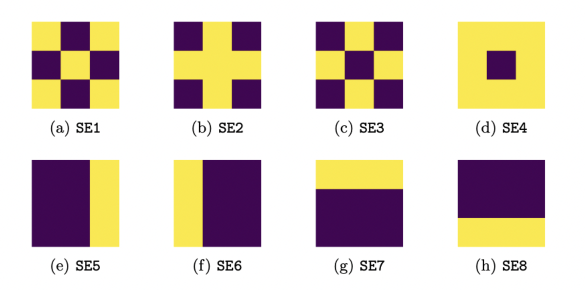

# IPARC_ChallengeV2

## Description

The aim of the IPARC Challenge is to identify if there exists an ILP engine capable of handling `Selection` `Iteration` and `Sequence` aspects of  [Böhm–Jacopini theorem](https://en.wikipedia.org/wiki/Structured_program_theorem). Please see the [presentation](./img/IJCLR2022_Slides.pdf) and the [article](./img/ARC.pdf) for details.

This repo contains the [dataset](./Dataset/), the [code](./GenerateDataset.py) which is used to generate the dataset, as well as target programs. We use `.json` file format for the input/output to the programs. The target programs are also written in `.txt` files.

Directory Structure of [dataset](./Dataset/)

```
Dataset/
    CatA_Hard/
        Task***.json 
        Task***_soln.json 
        Task***_soln.txt
    CatA_Simple/
    CatB_Selection/
    CatB_Iteration/
    CatB_Sequence/
    CatB_Hard/        
```

## Target Programs

The target program is a sequence of predicates, where each predicates has 4 elements - (i) Band (ii) Operator (iii) The structuring element or array (iv) Number of iterations. For example `1-HitOrMiss-SE8-2` operates on Band-1, using `HitOrMiss` with structuring element `SE8` and is repeated `2` times. 

The structuring elements for the morphological operators are described below. (Yellow indicates 1 and purple indicates 0.)



`TestPredicate.py` allows one to test each predicate on a given set of images. (See section [Accessing individual predicates](#accessing-individual-predicates) below for more details.)

## Notes

Run `python GenerateDataset.py` to generate the dataset.

### Category A (Simple)

The challenge here is to identify the a sequence of operators which explains the input-output pairs. We follow the following process to generate the input-output pairs for each task:

1. Each task is assigned a random sequence of structuring elements (SE1-SE8). The sequence of operations is defined by alternating dilations and erosions.

2. To generate an input-output pair for each task, we start with a randomly generated base-image. This base-image is considered as input, and the output is generated using the sequence in (1)

3. The generated input-output pairs for each task are saved in `./Dataset/CatA_Simple/Task***.json`. The sequence is saved at `./Dataset/CatA_Simple/Task***_soln.txt` by default.

**Remark 1 :** To avoid empty input-output pairs, we dilate the base-image with structuring elements corresponding to the erosion operator. 

**Remark 2 :** Also, sometimes it can so happen due to chance that input-output pairs might be empty. These are filtered out.

### Category A (Hard)

The hard challenge of Category A includes 3 colors and a color change rule. (See the article for details). The following are the main difference compared to the simple challenge.

1. Each task is now assigned 3 random sequences (one for each colour) of structuring elements (SE1-SE8). The sequence is defined by alternating dilations and erosions.

2. To generate an input-output pair for each task, we start with a randomly generated base-image. This base-image is considered as input, and the output is generated using the sequence in (1).

3. The generated input-output pairs for each task are saved in `./Dataset/CatA_Hard/Task***.json`. The sequence and the color change rule is saved at `./Dataset/CatA_Hard/Task***_soln.txt` by default.


### Category B (Simple)

The idea of Category B tasks arose from the **structured program theorem** which states that three control structures - sequence, selection and iteration are sufficient to represent any program. So, it follows that if an algorithm can learn these three aspects from data, it can reconstruct the program. This is to be achieved by predicate invention.


#### Category B - Sequence

Here the aim is to invent sequence predicates. Each task has a set of subtasks (3) which share a common sequence. So, this subsequence should be identified and added to the background knowledge.

The generated input-output pairs for each task are saved in `./Dataset/CatB_Sequence/Task***.json`. The sequence for each subtask is saved at `./Dataset/CatB_Sequence/Task***_soln.txt` by default.

#### Category B - Selection

Here the aim is to invent conditional predicates. To simulate the conditional we use the `Hit_or_Miss` transform which selects a set of pixels based on the pattern. The pixels which correspond to the pattern are processed by a sequence differently from the pixels which do not correspond to the pattern. 

The generated input-output pairs for each task are saved in `./Dataset/CatB_Selection/Task***.json`. The sequence is saved at `./Dataset/CatB_Selection/Task***_soln.txt` by default.

#### Category B - Iteration

Here the aim is to invent "Iterate k times" predicate. "k" is to be learnt. Each task has a set of subtasks (3) which share a common iteration. This should be learnt.

The generated input-output pairs for each task are saved in `./Dataset/CatB_Iteration/Task***.json`. The sequence for each subtask is saved at `./Dataset/CatB_Iteration/Task***_soln.txt` by default.

#### Category B - Hard

The hard tasks in category B combine all the three - Sequence, Iteration and Selection. The examples within each task consist of Selection of a few pixels using Hit-ot-Miss transform, and transforming them using Iteration and transforming the other pixels using Sequence.

### Testing a sequence

The file  `TestSequence.py` allows for testing whether a particular sequence works. The predicates are addressed in the following format [band]-[Operator]-[SE or Arr]-[number of iterate]. A `.json` file with the input and output pairs is provided to the program alond with a sequence of predicates.

An example is described below

```
python TestSequence.py ./Dataset/CatB_Hard/Task000.json 1-HitOrMiss-SE8-1 1-Dilation-SE6-2 1-Erosion-SE6-2  2-Dilation-SE8-1 2-Dilation-SE7-1 2-Dilation-SE5-1 2-Dilation-SE7-1 2-Erosion-SE7-1 2-Erosion-SE5-1 2-Erosion-SE7-1 1-ChangeColor-[[0,0,0],[0,1,2],[1,0,1],[1,1,2]]-1
```

tries to find whether the sequence explains the examples in `./Dataset/CatB_Hard/Task000.json`. 

### Accessing individual predicates

To get an output of each predicate we provide `TestPredicate.py`. The predicates are addressed in the following format [band]-[Operator]-[SE or Arr]-[number of iterate]. A `.json` file with the input images is to be used. The output for the inputs images is written in `.json` format. For example

```
python TestPredicate.py ./Dataset/CatB_Hard/Task000.json 1-HitOrMiss-SE8-1 > test.json
```

writes the output to `test.json` which can be processed further. 


